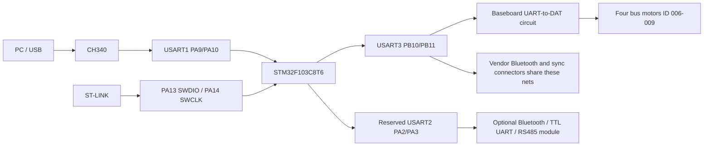
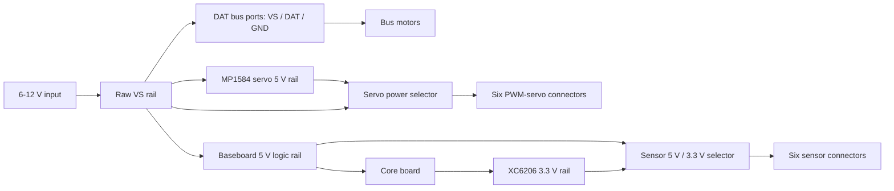

# C5 System Hardware

## Requirements and scope

The first firmware baseline must support three long-lived system needs:

1. control the four mecanum wheel motors;
2. retain an independent host-computer communication path, with room for UART Bluetooth or an external RS485 transceiver;
3. retain fixed and repeatable debug/programming access.

C25 material is out of scope until the C5 baseline is stable. The target project must not assume direct motor PWM or direct wheel-encoder wiring that is not present in the C5 evidence.

## System boundary

| Block | Function | Evidence status |
|---|---|---|
| Core board `ZL-KPZ32 V3` | STM32F103C8T6, CH340, W25Q64, HSE, reset/boot and LEDs | Confirmed by core-board schematic and vendor manual |
| Baseboard `ZL-KPZ V3.4` | Power distribution, H1 socket, DAT conversion, motor/servo/sensor/user interfaces | Confirmed by baseboard schematic |
| Four bus motors | Local controller and power driver in each motor module | Confirmed by vendor bus-motor manual |
| PC over USB | CH340 to MCU USART1 | Confirmed by core schematic and vendor manual |
| Optional external host link | USART2 on PA2/PA3 from H1; external transceiver/module required | Design reservation based on confirmed H1 nets |

## Signal architecture

The vendor Bluetooth connector is not an independent MCU UART. Its baseboard nets share the same `TXD1/RXD1` path that H1 labels `TXD3/RXD3` and that the firmware configures as USART3. It may be supported later as a shared-bus legacy interface, but it is not counted as the reserved independent host channel.

## Power architecture

Motor modules receive raw `VS` whenever the bus is powered. Therefore MCU GPIO reset state alone cannot guarantee a stopped car; startup stop commands and communication-loss behavior are separate safety requirements.

## Evidence-backed facts

| Item | Current value | Evidence | Status | Hardware tested |
|---|---|---|---|---|
| Application MCU | STM32F103C8T6, 64 KiB Flash, 20 KiB SRAM | Vendor manual; Keil target names STM32F103C8 | Confirmed | No |
| Core/base schematics | `ZL-KPZ32 V3` and `ZL-KPZ V3.4` document revisions | Vendor PDF filenames and title blocks | Confirmed as document revisions | Physical silk not yet verified |
| Motor architecture | Four independent 6-12 V single-wire UART bus motors | Bus-motor and C5 ID manuals | Confirmed | No |
| Wheel IDs | 006 left-front, 007 right-front, 008 left-rear, 009 right-rear | C5 device-ID manual | Confirmed as vendor configuration | No |
| Motor command | `#idPpwmTtime!`; `P1500` means stop; ID 255 is broadcast | Bus-motor manual | Confirmed | No |
| Diagnostic/download UART | USART1 PA9/PA10 through CH340, 115200 | Core schematic and vendor manual | Confirmed | No physical COM observed in this task |
| Motor UART | USART3 PB10/PB11 through baseboard DAT circuit | Core/base schematics and vendor source | Confirmed | No |
| Optional host UART | USART2 PA2/PA3, exposed as H1 pins 26/24 | H1 schematic and MCU pin functions | Design reservation | No |
| Debug | PA13 SWDIO and PA14 SWCLK, also connected to PS2 nets | Core schematic | Confirmed electrically | Connector continuity not tested |
| External Flash | W25Q64 on SPI2 PB12-PB15 | Core schematic and vendor source | Confirmed | No |
| Status LED | PB13, active low, shared with SPI2_SCK | Core schematic and vendor source | Confirmed | No |
| HSE | 8 MHz; configure PLL x9 for 72 MHz | Vendor `src/z_rcc.c`; accepted as project input by user | Accepted design input | No |
| H1 access | Two black female header rows remain available for Dupont-wire breakout with the core installed | User-supplied physical photo and observation | User-observed | Visually observed only |

## Primary evidence

- [Core-board schematic](<../reference/c5-vendor/002-智能车套件-C5小车（STM32）/004-软件工具/05-原理图/核心板-ZL-KPZ32_V3.pdf>)
- [Baseboard schematic](<../reference/c5-vendor/002-智能车套件-C5小车（STM32）/004-软件工具/05-原理图/底板-ZL-KPZ V3.4.pdf>)
- [Main-control-board manual](<../reference/c5-vendor/002-智能车套件-C5小车（STM32）/001-文档教程/1.7、主控板学习-STM32-V1.0.pdf>)
- [C5 device-ID manual](<../reference/c5-vendor/002-智能车套件-C5小车（STM32）/001-文档教程/1.4.2、C5小车设备ID分布图-V1.0.pdf>)
- [Bus-motor manual](<../reference/c5-vendor/002-智能车套件-C5小车（STM32）/001-文档教程/相关模块介绍/2、总线电机介绍-V1.0.pdf>)
- [Vendor STM32 source archive](<../reference/c5-vendor/002-智能车套件-C5小车（STM32）/003-源码例程/02-出厂程序源码/Carbot(C5)-STM32智能车出厂程序-250518.zip>)
