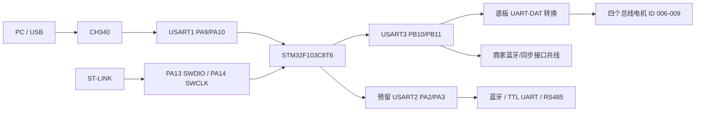
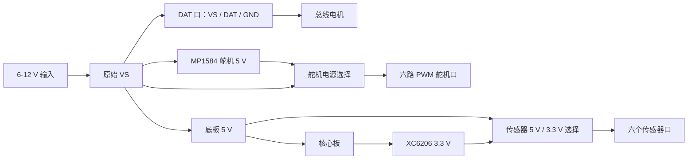

# C5 系统硬件

## 需求

1. 控制四个麦克纳姆轮电机；
2. 保留独立上位机链路，可接串口蓝牙或外置 RS485；
3. 保留固定、可重复的调试与烧录接口。

C5 基线稳定前不引入 C25。C5 电机不是 MCU 直驱 PWM，不能按通用小车方案假设编码器和电机接线。

## 系统边界

| 模块 | 功能 | 证据 |
|---|---|---|
| 核心板 `ZL-KPZ32 V3` | STM32F103C8T6、CH340、W25Q64、HSE、启动/复位、LED | 核心板原理图、手册 |
| 底板 `ZL-KPZ V3.4` | 电源、H1、DAT 转换、电机/舵机/传感器接口 | 底板原理图 |
| 四个总线电机 | 每个模块内置控制器与功率驱动 | 总线电机手册 |
| USB 上位机 | CH340 → USART1 | 原理图、手册 |
| 独立扩展链路 | H1 引出 USART2 PA2/PA3，外接模块/收发器 | H1 网络与设计预留 |

## 信号结构

商家蓝牙口与 USART3 相关网络共线，不算独立上位机串口；独立链路预留 USART2。

## 电源结构

总线一上电，电机模块即获得 `VS`。GPIO 复位态不能单独保证停车，仍需上电停车指令和断联策略。

## 已知事实

| 项目 | 结论 | 状态 | 实测 |
|---|---|---|---|
| MCU | STM32F103C8T6，64 KiB Flash、20 KiB SRAM | 已确认 | 否 |
| 原理图版本 | 核心板 V3、底板 V3.4 | 文档版本已确认 | 丝印未核 |
| 电机 | 四个 6–12 V 单线 UART 总线电机 | 已确认 | 否 |
| 轮位/ID | 006 左前、007 右前、008 左后、009 右后 | 商家配置 | 否 |
| 指令 | `#idPpwmTtime!`；`P1500` 停车；255 广播 | 已确认 | 否 |
| 诊断/下载 | USART1 PA9/PA10 → CH340，115200 | 已确认 | 未见实体 COM |
| 电机串口 | USART3 PB10/PB11 → DAT 电路 | 已确认 | 否 |
| 上位机预留 | USART2 PA2/PA3，H1 26/24 | 设计预留 | 否 |
| 调试 | PA13 SWDIO、PA14 SWCLK，与 PS2 复用 | 电气连接已确认 | 连通性未测 |
| 外部 Flash | W25Q64，SPI2 PB12–PB15 | 已确认 | 否 |
| 状态灯 | PB13，低电平亮，与 SPI2_SCK 共用 | 已确认 | 否 |
| HSE | 8 MHz，PLL ×9 → 72 MHz | 已接受输入 | 否 |
| H1 实物 | 核心板安装后仍可从两排母座引线 | 用户观察 | 仅目视 |

## 主要证据

- [核心板原理图](<../reference/c5-vendor/002-智能车套件-C5小车（STM32）/004-软件工具/05-原理图/核心板-ZL-KPZ32_V3.pdf>)
- [底板原理图](<../reference/c5-vendor/002-智能车套件-C5小车（STM32）/004-软件工具/05-原理图/底板-ZL-KPZ V3.4.pdf>)
- [主控板手册](<../reference/c5-vendor/002-智能车套件-C5小车（STM32）/001-文档教程/1.7、主控板学习-STM32-V1.0.pdf>)
- [C5 设备 ID 图](<../reference/c5-vendor/002-智能车套件-C5小车（STM32）/001-文档教程/1.4.2、C5小车设备ID分布图-V1.0.pdf>)
- [总线电机手册](<../reference/c5-vendor/002-智能车套件-C5小车（STM32）/001-文档教程/相关模块介绍/2、总线电机介绍-V1.0.pdf>)
- [商家 STM32 源码](<../reference/c5-vendor/002-智能车套件-C5小车（STM32）/003-源码例程/02-出厂程序源码/Carbot(C5)-STM32智能车出厂程序-250518.zip>)
