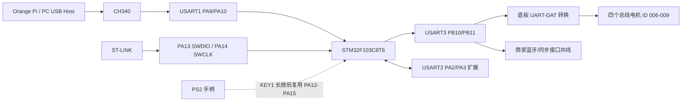
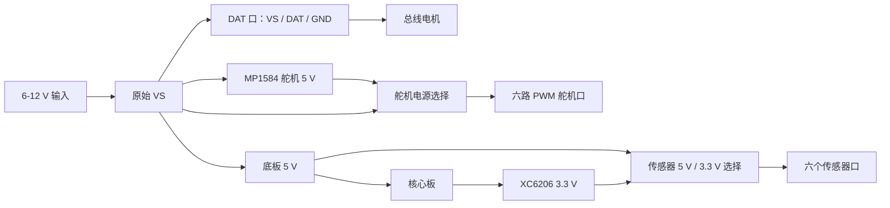

# C5 系统硬件

## 需求

1. 控制四个麦克纳姆轮电机；
2. 保留独立上位机链路，可接串口蓝牙或外置 RS485；
3. 保留固定、可重复的调试与烧录接口。

次要功能：支持 PS2 手柄直接操控底盘。它不影响核心运动接口，但与
SWD 复用 PA13/PA14，必须通过显式模式切换启用。

C5 基线稳定前不引入 C25。C5 电机不是 MCU 直驱 PWM，不能按通用小车方案假设编码器和电机接线。

## 系统边界

| 模块 | 功能 | 证据 |
|---|---|---|
| 核心板 `ZL-KPZ32 V3` | STM32F103C8T6、CH340、W25Q64、HSE、启动/复位、LED | 核心板原理图、手册 |
| 底板 `ZL-KPZ V3.4` | 电源、H1、DAT 转换、电机/舵机/传感器接口 | 底板原理图 |
| 四个总线电机 | 每个模块内置控制器与功率驱动 | 总线电机手册 |
| 默认 HOST/下载链路 | Orange Pi 或 PC USB → CH340 → USART1 | 原理图、手册；软件传输层 |
| 扩展上位机链路 | H1 引出 USART2 PA2/PA3，可接 3.3 V UART 或外置 RS485 收发器 | H1 网络 |
| PS2 手柄 | PA12 CLK、PA13 ATT、PA14 CMD、PA15 DAT | 原理图与商家源码一致；6P 接口与通信已实测 |

## 信号结构

```mermaid
flowchart LR
    HOST["Orange Pi / PC USB Host"] --> CH340["CH340"]
    CH340 --> U1["USART1 PA9/PA10"]
    U1 --> MCU["STM32F103C8T6"]
    MCU --> U3["USART3 PB10/PB11"]
    U3 --> DAT["底板 UART-DAT 转换"]
    DAT --> M["四个总线电机 ID 006-009"]
    U3 --> LEGACY["商家蓝牙/同步接口共线"]
    MCU <--> U2["USART2 PA2/PA3 扩展"]
    SWD["ST-LINK"] --> DBG["PA13 SWDIO / PA14 SWCLK"]
    DBG --> MCU
    PS2["PS2 手柄"] -. "KEY1 长按后复用 PA12-PA15" .-> MCU
```

商家蓝牙口与 USART3 相关网络共线，不算独立上位机串口。默认 HOST 使用核心板
CH340/USART1；USART2 保留为独立扩展链路，不与电机流量共线。
PS2 与 SWD 不能同时驱动 PA13/PA14：上电默认保留 SWD，断开 ST-LINK 后
长按 KEY1 才进入 PS2 模式，复位或再次长按恢复调试模式。详见
[PS2 遥控与 SWD 复用](ps2-control.md)。

## 电源结构

```mermaid
flowchart LR
    VIN["6-12 V 输入"] --> VS["原始 VS"]
    VS --> BUS["DAT 口：VS / DAT / GND"]
    BUS --> MOTORS["总线电机"]
    VS --> SERVO5["MP1584 舵机 5 V"]
    SERVO5 --> SELS["舵机电源选择"]
    VS --> SELS
    SELS --> PWM["六路 PWM 舵机口"]
    VS --> LOGIC5["底板 5 V"]
    LOGIC5 --> CORE["核心板"]
    CORE --> V33["XC6206 3.3 V"]
    LOGIC5 --> SELN["传感器 5 V / 3.3 V 选择"]
    V33 --> SELN
    SELN --> SENSORS["六个传感器口"]
```

总线一上电，电机模块即获得 `VS`。GPIO 复位态不能单独保证停车，仍需上电停车指令和断联策略。
实测两节 14500 降至单节约 2.3–2.5 V 时，模块指示灯和通信仍可能响应，
但电机无法可靠转动；充电后四轮运动恢复。判断电机故障前应先测量负载下 `VS`。

## 实物接线

- 底板两排黑色母座是 H1 核心板安装座，不作为外部烧录插座；ST-LINK 直接接核心板排针的 PA13/SWDIO、PA14/SWCLK、GND 和 3.3 V。
- 到货已接好的 6P 线连接 PS2 接收器与 PA12–PA15、3.3 V、GND。
- 默认 HOST 用 USB-A ↔ 核心板 USB 数据线连接 Orange Pi 与 CH340，不接 40-pin 或 H1 信号线。Linux 优先使用 `/dev/serial/by-id/...`；多串口时显式指定设备。
- 核心板 USB VBUS 经 D5 单向送入板上 5 V，可给核心板逻辑供电且不作为电机动力。USB 插拔和 CH340 DTR/RTS 可能触发自动下载复位，须在 HOST 实测中核验。
- 六个 3P 总线口并联，每根线同时承载 `DAT`、`VS` 和 `GND`；电机可分别直连或级联，轮位由设备 ID 决定。
- 动力来自两节 14500 或绿色端子的 6–12 V 输入，经总开关送入 `VS`；USB 不作为电机动力电源。

## 已知事实

| 项目 | 结论 | 状态 | 实测 |
|---|---|---|---|
| MCU | STM32F103C8T6，64 KiB Flash、20 KiB SRAM | 已确认 | 否 |
| 原理图版本 | 核心板 V3、底板 V3.4 | 文档版本已确认 | 丝印未核 |
| 电机 | 四个 6–12 V 单线 UART 总线电机 | 已确认 | 架空及整车运动通过 |
| 轮位/ID | 006 左前、007 右前、008 左后、009 右后 | 商家配置 | 否 |
| 指令 | `#idPpwmTtime!`；`P1500` 停车；255 广播 | 已确认 | 否 |
| HOST/下载 | USART1 PA9/PA10 → CH340，115200 | 电气已确认；HOST 为软件设计 | 枚举、双向帧、零速 ARM/STOP、超时通过 |
| 电机串口 | USART3 PB10/PB11 → DAT 电路 | 已确认 | 四轮响应通过 |
| 扩展串口 | USART2 PA2/PA3，经 H1 引出 | 已确认 | 未接线 |
| 调试 | PA13 SWDIO、PA14 SWCLK，与 PS2 复用 | 电气连接已确认 | 核心板排针烧录通过；退出重连未测 |
| PS2 | PA12 CLK、PA13 ATT、PA14 CMD、PA15 DAT；KEY1 PA8 切换模式 | 引脚已确认 | 模拟模式与三轴遥控通过 |
| 外部 Flash | W25Q64，SPI2 PB12–PB15 | 已确认 | 否 |
| 状态灯 | PB13，低电平亮，与 SPI2_SCK 共用 | 已确认 | 熄灭/闪烁/常亮通过 |
| HSE | 8 MHz，PLL ×9 → 72 MHz | 已接受输入 | 否 |
| H1 实物 | 两排黑色母座用于底板安装核心板；烧录线接核心板排针 | 用户观察 | 已确认接法 |

## 主要证据

- [核心板原理图](<../reference/c5-vendor/002-智能车套件-C5小车（STM32）/004-软件工具/05-原理图/核心板-ZL-KPZ32_V3.pdf>)
- [底板原理图](<../reference/c5-vendor/002-智能车套件-C5小车（STM32）/004-软件工具/05-原理图/底板-ZL-KPZ V3.4.pdf>)
- [主控板手册](<../reference/c5-vendor/002-智能车套件-C5小车（STM32）/001-文档教程/1.7、主控板学习-STM32-V1.0.pdf>)
- [C5 设备 ID 图](<../reference/c5-vendor/002-智能车套件-C5小车（STM32）/001-文档教程/1.4.2、C5小车设备ID分布图-V1.0.pdf>)
- [总线电机手册](<../reference/c5-vendor/002-智能车套件-C5小车（STM32）/001-文档教程/相关模块介绍/2、总线电机介绍-V1.0.pdf>)
- [商家 STM32 源码](<../reference/c5-vendor/002-智能车套件-C5小车（STM32）/003-源码例程/02-出厂程序源码/Carbot(C5)-STM32智能车出厂程序-250518.zip>)
