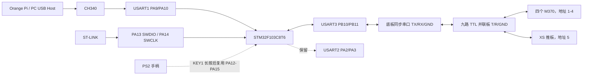
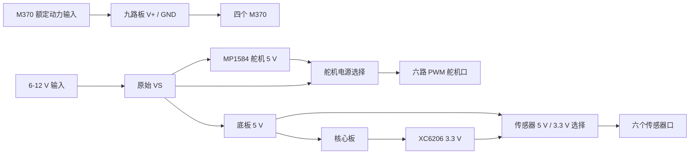

# C5 系统硬件

## 需求

1. 控制四个麦克纳姆轮电机；
2. 保留独立上位机链路，可接串口蓝牙或外置 RS485；
3. 保留固定、可重复的调试与烧录接口。

次要功能：支持 PS2 手柄直接操控底盘。它不影响核心运动接口，但与
SWD 复用 PA13/PA14，必须通过显式模式切换启用。

C5 基线稳定前不引入 C25。C5 电机不是 MCU 直驱 PWM，不能按通用小车方案假设编码器和电机接线。

## 系统边界

| 模块 | 功能 | 证据 |
|---|---|---|
| 核心板 `ZL-KPZ32 V3` | STM32F103C8T6、CH340、W25Q64、HSE、启动/复位、LED | 核心板原理图、手册 |
| 底板 `ZL-KPZ V3.4` | 电源、H1、DAT 转换、电机/舵机/传感器接口 | 底板原理图 |
| 四个 M370 闭环减速电机 | 每个电机内置控制器，安装 TTL 插件 | M370 用户手册；用户实物选择 |
| Emm42 闭环步进推板电机 | 计划复用九路板 TTL T/R/GND，地址 5，两端为机械硬挡 | 用户型号与实物观察；X42S V1.0.5 手册与厂商 STM32F103 Emm V5 例程 |
| 默认 HOST/下载链路 | Orange Pi 或 PC USB → CH340 → USART1 | 原理图、手册；软件传输层 |
| M370 电机链路 | USART3 PB10/PB11 经底板同步串口接九路并联板 TTL T/R/GND | 原理图；用户确认底板可施工接口 |
| PS2 手柄 | PA12 CLK、PA13 ATT、PA14 CMD、PA15 DAT | 原理图与商家源码一致；6P 接口与通信已实测 |

## 信号结构

```mermaid
flowchart LR
    HOST["Orange Pi / PC USB Host"] --> CH340["CH340"]
    CH340 --> U1["USART1 PA9/PA10"]
    U1 --> MCU["STM32F103C8T6"]
    MCU <--> U3["USART3 PB10/PB11"]
    U3 <--> SYNC["底板同步串口 TX/RX/GND"]
    SYNC <--> SPLIT["九路 TTL 并联板 T/R/GND"]
    SPLIT <--> M["四个 M370，地址 1-4"]
    SPLIT <--> PUSH["XS 推板，地址 5"]
    MCU -. "保留" .-> U2["USART2 PA2/PA3"]
    SWD["ST-LINK"] --> DBG["PA13 SWDIO / PA14 SWCLK"]
    DBG --> MCU
    PS2["PS2 手柄"] -. "KEY1 长按后复用 PA12-PA15" .-> MCU
```

商家蓝牙口与 USART3 网络共线，不算独立上位机串口。默认 HOST 使用核心板
CH340/USART1；USART3 专用于新 M370 TTL 总线，其他共线外部端口保持空闲。底板未见 RS485 收发器，TTL 板不得接 A/B。
PS2 与 SWD 不能同时驱动 PA13/PA14：上电默认保留 SWD，断开 ST-LINK 后
长按 KEY1 才进入 PS2 模式，复位或再次长按恢复调试模式。详见
[PS2 遥控与 SWD 复用](ps2-control.md)。

## 电源结构

```mermaid
flowchart LR
    VIN["6-12 V 输入"] --> VS["原始 VS"]
    MVIN["M370 额定动力输入"] --> SPLITP["九路板 V+ / GND"]
    SPLITP --> MOTORS["四个 M370"]
    VS --> SERVO5["MP1584 舵机 5 V"]
    SERVO5 --> SELS["舵机电源选择"]
    VS --> SELS
    SELS --> PWM["六路 PWM 舵机口"]
    VS --> LOGIC5["底板 5 V"]
    LOGIC5 --> CORE["核心板"]
    CORE --> V33["XC6206 3.3 V"]
    LOGIC5 --> SELN["传感器 5 V / 3.3 V 选择"]
    V33 --> SELN
    SELN --> SENSORS["六个传感器口"]
```

九路板动力一上电，M370 即获得 `V+`。GPIO 复位态不能单独保证停车，仍需上电停车指令和断联策略。
旧电机曾在动力电压不足时出现“指示灯响应但不转”。M370 调试同样必须测量负载下
九路板 `V+`，但旧电池结果不能作为新电机的供电验收。

## 实物接线

- 底板两排黑色母座是 H1 核心板安装座，不作为外部烧录插座；ST-LINK 直接接核心板排针的 PA13/SWDIO、PA14/SWCLK、GND 和 3.3 V。
- 到货已接好的 6P 线连接 PS2 接收器与 PA12–PA15、3.3 V、GND。
- 默认 HOST 用 USB-A ↔ 核心板 USB 数据线连接 Orange Pi 与 CH340，不接 40-pin 或 H1 信号线。Linux 优先使用 `/dev/serial/by-id/...`；多串口时显式指定设备。
- 核心板 USB VBUS 经 D5 单向送入板上 5 V，可给核心板逻辑供电且不作为电机动力。USB 插拔和 CH340 DTR/RTS 可能触发自动下载复位，须在 HOST 实测中核验。
- M370 九路板各 8P 口并联；TTL 模式使用 T、R、GND 和 V+，轮位由设备地址决定。
- 同步串口 3/TXD 接九路板 R，2/RXD 接九路板 T，4/GND 接 GND；1/KEY1、5/5 V 和九路板 Dir/Stp/En/Com 不接。
- M370 动力从九路板电源输入口或 V+/GND 输入；STM32 3.3 V/5 V 和 USB 不作为电机动力电源。
- XS 只确认复用 TTL 信号总线；额定电压、动力接法和共地要求需按实物铭牌/手册确认后施工。

## 已知事实

| 项目 | 结论 | 状态 | 实测 |
|---|---|---|---|
| MCU | STM32F103C8T6，64 KiB Flash、20 KiB SRAM | 已确认 | 否 |
| 原理图版本 | 核心板 V3、底板 V3.4 | 文档版本已确认 | 丝印未核 |
| 电机 | 四个 M370，TTL 插件接九路并联板，实物减速比 10:1 | 用户选择与观察；手册支持 | 已接线并由 PS2 驱动 |
| 推板 | Emm42 闭环步进，ID 5，计划复用 USART3 TTL TX/RX/GND；STM32 不接限位 GPIO | 用户确认；X42S V1.0.5 手册与 Emm V5 例程 | ID 5 掉电保存、收回约 -0.6 度、推出约 186.0 度已确认；两端为机械硬挡；串口动作无实际力矩，接入暂停 |
| 轮位/ID | 1 左前、2 右前、3 左后、4 右后 | 软件设计；WCH-Link 逐台读取 | 已确认，2/3/4 掉电保存通过 |
| 指令 | M370 `F6` 速度、`FE` 停车、`AA` 多电机帧，校验 `0x6B` | 手册确认；软件实现 | WCH-Link 直连及 STM32/PS2 运动通过 |
| HOST/下载 | USART1 PA9/PA10 → CH340，115200 | 电气已确认；HOST 为软件设计 | 枚举、双向帧、零速 ARM/STOP、超时通过 |
| 电机串口 | USART3 PB10/PB11 → 同步串口 3/2 → TTL R/T | 引脚已确认；方案已实现 | PS2 运动链路通过 |
| USART2 | PA2/PA3 → H1 26/24 | 已确认 | 底板无可施工外露口，保留不用 |
| 调试 | PA13 SWDIO、PA14 SWCLK，与 PS2 复用 | 电气连接已确认 | 核心板排针烧录通过；退出重连未测 |
| PS2 | PA12 CLK、PA13 ATT、PA14 CMD、PA15 DAT；KEY1 PA8 切换模式 | 引脚已确认 | 模拟模式与三轴遥控通过 |
| 外部 Flash | W25Q64，SPI2 PB12–PB15 | 已确认 | 否 |
| 状态灯 | PB13，低电平亮，与 SPI2_SCK 共用 | 已确认 | 熄灭/闪烁/常亮通过 |
| HSE | 8 MHz，PLL ×9 → 72 MHz | 已接受输入 | 否 |
| H1 实物 | 两排黑色母座用于底板安装核心板；烧录线接核心板排针 | 用户观察 | 已确认接法 |

## 主要证据

- [核心板原理图](<../reference/c5-vendor/002-智能车套件-C5小车（STM32）/004-软件工具/05-原理图/核心板-ZL-KPZ32_V3.pdf>)
- [底板原理图](<../reference/c5-vendor/002-智能车套件-C5小车（STM32）/004-软件工具/05-原理图/底板-ZL-KPZ V3.4.pdf>)
- [主控板手册](<../reference/c5-vendor/002-智能车套件-C5小车（STM32）/001-文档教程/1.7、主控板学习-STM32-V1.0.pdf>)
- [C5 设备 ID 图](<../reference/c5-vendor/002-智能车套件-C5小车（STM32）/001-文档教程/1.4.2、C5小车设备ID分布图-V1.0.pdf>)
- [总线电机手册](<../reference/c5-vendor/002-智能车套件-C5小车（STM32）/001-文档教程/相关模块介绍/2、总线电机介绍-V1.0.pdf>)
- [商家 STM32 源码](<../reference/c5-vendor/002-智能车套件-C5小车（STM32）/003-源码例程/02-出厂程序源码/Carbot(C5)-STM32智能车出厂程序-250518.zip>)
